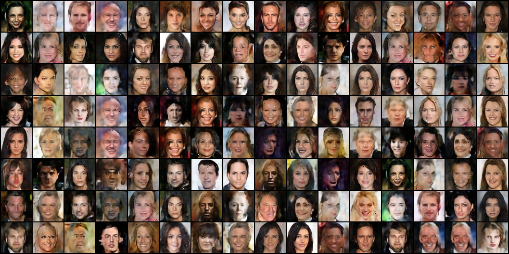

# Idempotent Generative Network

paper: Idempotent Generative Network, https://arxiv.org/abs/2311.01462

This is a simple unofficial implementation. We trained it on the Celeba dataset.

# Usage

first, download the Celeba dataset and unzip it to the `data` folder.

then, install the requirements:
```shell
pip install -r requirements.txt
```

## train

modify the parameters in `config.yml` as your needed and run:
```shell
python train.py
```

## generate
model checkpoint with 1000 epoch training, [download here](https://drive.google.com/file/d/1tqR7GZb1HXSfgybCKQ--TpCHjvQgLdx8/view?usp=sharing).

These are the parameters of `generate.py`:
* `-cp`: the path of checkpoint. default: `./checkpoints/model.pth`
* `--config`: the path of config file. default: `./config.yml`
* `-bs`: how many images to generate at once. default: `16`
* `--nrow`: how many images are displayed in a row, only valid when `steps=1`. default: `4`
* `--steps`: the times of applying model. default: `1`
* `--show`: whether to show the generated images. default: `False`
* `-sp`: save path of the result image. default: None
* `--device`: the device to use. default: `cuda`
* `--to_grayscale`: whether to convert the generated images to grayscale. default: `False`

generate one step images:
```shell
python generate.py -cp "./checkpoints/model.pth" --config "./config.yml" -bs 128 --nrow 16 --show -sp "./result/one_step.png"
```



generate multi step images:
```shell
python generate.py -cp "./checkpoints/model.pth" --config "./config.yml" -bs 8 --steps 3 --show -sp "./result/three_steps.png"
```


